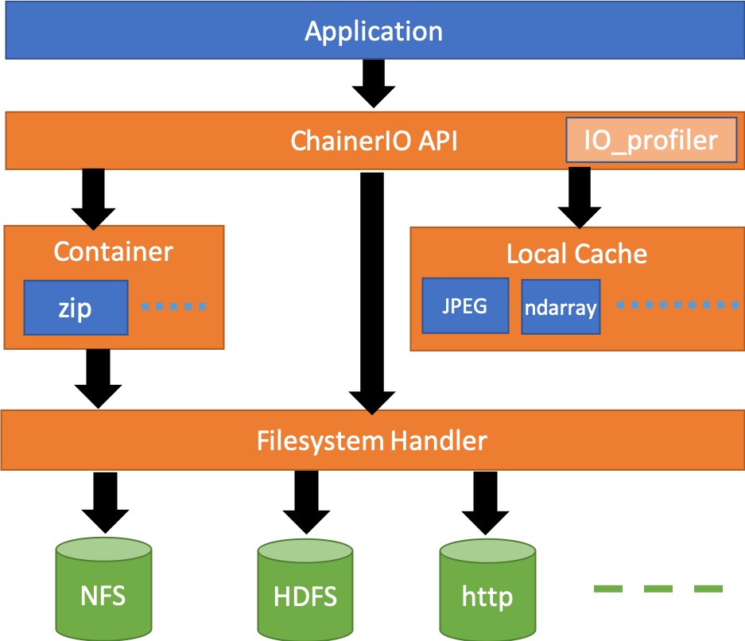

Design
------

PFIO is an IO abstraction library for Chainer, optimized for deep
learning training with batteries included. It supports

- Filesystem API abstraction with unified error semantics,
- Explicit user-land caching system,
- IO performance tracing and metrics stats, and
- Fileset container utilities to save metadata.

Rationale
+++++++++

There are a lot of non-POSIX-compliant filesystems in the industry and
all of them have Pros and Cons, from cloud storages like Google Cloud
Storage and Amazon S3, to on-premise distributed filesystems like
HDFS. Supporting different filesystems by developers themselves
creates unnecessary burden on the developers and might reduce the
portability on the code. That is the motivation of PFIO
supporting *filesystem abstraction API*.

Also, deep learning training programs have benefited from filesystem
page caching provided Linux kernel because its optmization method is
based on stochastic gradient descent, where all training data is
repeatedly read to iteratively train the model. But such
non-POSIX-compliant filesystem usually does not provide content
caching capability and I/O workload of training program would not
implicitly optmized unlike Posix-based filesystems in Linux.  To help
with learning on non-POSIX-compliant filesystems, e.g. HDFS, PFIO
implements *data caching capability in userland*. Moreover, developers
can choose which data to cache, from the raw files to DNN input NumPy
array.

Opmization in deep learning model training is also important as the
model training usually takes long time and even 1% speedup is
important. Modern external non-Posix filesystem is based on
complex communication protocol between multiple data nodes and its
performance metrics are not simply observable. *Built-in tracing
system,* would be the first step for optimization, mitigating the
complexity problem.

One of the general problems in filesystems is scalability of metadata
access, caused by inbalanced ratio of number of files and total
capacity of one system. PFIO supports various *container file
formats to aggregate many small files into single large file* with
metadata mapping, e.g. HDF5, ZIP and Tar (and more in future), by
taking advantage of the fact that in machine learning training
workload, usually SGD, is repeated read of single fixed dataset
(Write-once-and-read-many). Aggregating millions of single-kilobytes
files into single file would save a lot of metadata store.

Architecture
++++++++++++

PFIO abstracts underlying system with three objects. See API
documentation for details.

FileSystem
~~~~~~~~~~

Abstraction of each filesystems. Depending on the context the term
might stand for the filesystem type, or the (network) filesystem
instance. It supports

- Getting basic information of the filesystem (info)
- Container creation, deletion
- Accessing containers
- Accessing raw files
- Listing all files under specific directory
- Primarily HDFS and POSIX, and AWS S3 API

FS
~~~~~

Abstraction of a directory subtree, or file containers such as ZIP. It
contains a set of (key, binary object) pairs. Keys are typically
path-like string and binary is typically a file content. In PFIO keys
in a container are UTF-8 strings. Containers can be nested, e.g. ZIP
in ZIP. It supports:

- Showing basic information of the container (info)
- Accessing raw files included (open)
- Accessing containers included (open)
- Adding and remove file (create, delete)
- Listing keys in a container
- Primarily ZIP, and possibly Hdf5?

.. code-block:: python

    import pfio
    from PIL import Image
    import io

    with pfio.v2.from_url('hdfs://name-service-cluster1/some/many-files-dataset.zip') as fs:
        print(container.info())
        # List all keys in the container
        for name in fs.list(recursive=True):
            print(name)

        # Obtains a file object to access binary content that
        # corresponds to the key ``some/file.jpg``
        with fs.open('some/file.jpg', 'rb') as fp:
            binary = fp.read()
            image = Image(io.BytesIO(binary))
            ...

File-like Objects
~~~~~~~~~~~~~~~~~

Abstraction of binary objects or files, typically returned by
``fs.open`` method. It is an implementation of ``RawIOBase`` class
(See `RawIOBase
<https://docs.python.org/3/library/io.html#io.RawIOBase>`__ in Python
document). It supports

- Read to underlying file or binary in a container
- Writes supported by filesystems, but possibly not in containers

URI Expression of File Paths
~~~~~~~~~~~~~~~~~~~~~~~~~~~~

Filesystems can be expressed as::

   <filesystem> := <scheme>[://<service-idenfier>]

where ``scheme`` represends the filesystem type. Currently ``hdfs``
and ``file`` are supported. ``hdfs`` stands for HDFS and ``file``
means local filesystem. For remote network file system like HDFS,
``service-identifier`` stands for service instance. It can be omitted
when the default service is defined. For example in HDFS, it is the
name of name service described in ``hdfs-site.xml`` in the Hadoop
configuration directory like following example::

  <configuration>
    <property>
      <name>dfs.nameservices</name>
      <value>hdfs-nameservice1</value>
    </property>
    ...

In this example is ``service-identifier`` is ``hdfs-nameservice``.

Containers, files are uniquely identifiable by partial
set of URI expression::

   <uri> := <scheme>://[<service-idenfier>]/<path>

``service-identifier`` can be omitted when it can be uniquely defined
by the environment. ``path`` is a UTF-8 string, a sequence of path
segments separated by ``/`` and path segments are recommended to only
use ``[a-z][A-Z][0-9][_-]`` . However, details depend on underlying filesystem
implementation or containers.

``pfio.open_as_container`` and ``pfio.fs.open`` take
``filesystem``, ``uri`` or ``path`` as an argument to identify the
file to be opened, when the context is a filesystem.  If the context
is a container, they accept a key as an argument.

If the context is a file system, they also take a ``path`` as a
relative path. The base for relative path depends on filesystems; for
HDFS it is home directory and for POSIX it is current working
directory.

For example, all these ``fs.open`` open the same file, given that the
default name service is ``name-service1`` and user Smith's home
derectory is defined as ``/user/smith``:

.. code-block:: python

    import pfio

    # Using full URI
    pfio.open('hdfs://name-service1/user/smith/path/to/file.txt')

    # Using set_root and absolute path
    pfio.set_root('hdfs://name-service1/')
    pfio.open('/user/smith/path/to/file.txt')

    # Using set root and relative path
    pfio.set_root('hdfs')
    pfio.open('path/to/file.txt')

    # Overwrite the global setting with full URI
    # Access the posix with the global setting to hdfs
    pfio.open('file://path/to/file.txt')

    # Accessing with filesystem object
    with pfio.create_handler('hdfs') as handler:
        handler.open('file.txt')

Major Use Cases
++++++++++++++++

With all these primitive concepts and operations PFIO supports
various use cases from loading training data, taking snapshots of
models in the middle of training process, and recording the final
model.

In order to load training data in Chainer, developers create a
`dataset` class which derived the `DatasetMixin` from the
`chainer.dataset` package. PFIO will provide several
implementation replacements for generic datasets included in Chainer
and other Chainer family libraries.

According to the survey we conduct on developers' code. I/Os can be
categorized into two different classes.

1. Inputs and outputs using file object: direct access via
   built-in APIs e.g. `Image` class in PIL, `cv2.image.open` and
   `pandas.read_hdf`.  In such case, the file object (in PFIO, it
   is implementation of `RawIOBase
   <https://docs.python.org/3/library/io.html#raw-i-o>`_ )

2. Inputs and outputs all wrapped by 3rd party library. Some of them
   has functions only takes the file path string as an argument and
   all file operations are hidden underneath the library. Examples are
   `cv2.VideoWriter()`, `cv2.imread()` and `cv2.VideoCapture()` from
   OpenCV. Since we cannot change the library, we provide a monkey
   patch of major libraries frequently used along with Chainer.

For details see API.

V2 API history
++++++++++++++

PFIO v2 API tries to solve the impedance mismatch between different
local filesystem, NFS, and other object storage systems, with a lot
simpler and cleaner code.

It has removed several toplevel functions that seem to be less
important. It turned out that they introduced more complexity than
originally intended, due to the need of the global context. Thus,
functions that depends on the global context such as ``open()``,
``set_root()`` and etc. have been removed in v2 API.

Instead, v2 API provides only two toplevel functions that enable
direct resource access with full URL: ``open_url()`` and
``from_url()``. The former opens a file and returns FileObject. The
latter, creates a ``fs.FS`` object that enable resource access under
the URL. The new class ``fs.FS``, is something close to handler object
in version 1 API. ``fs.FS`` is intended to be as much compatible as
possible, however, it has several differences.

One notable difference is that it has the virtual concept of current
working directory, and thus provides ``subfs()`` method. ``subfs()``
method behaves like ``chroot(1)`` or ``os.chdir()`` without actually
changing current working directory of the process, but actually
returns a *new* ``fs.FS`` object that has different working
directory. All resouce access through the object automatically
prepends the working directory.

V2 API does not provide lazy resouce initialization any more. Instead,
it provides simple wrapper ``lazify()``, which recreates the ``fs.FS``
object every time the object experiences ``fork(2)``. ``Hdfs`` and
``Zip`` can be wrapped with it, and will be fork-tolerant object.
